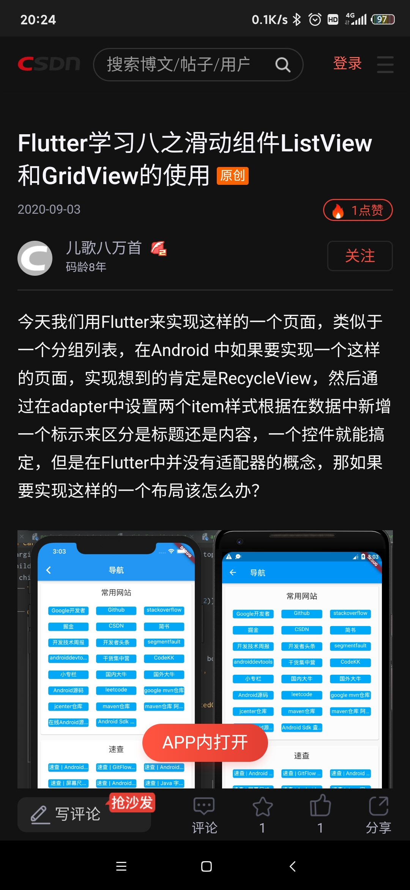
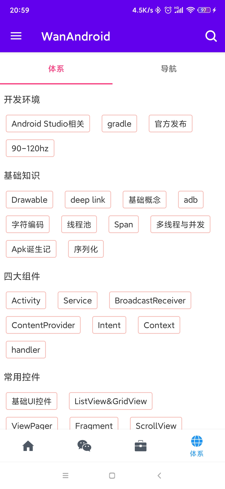
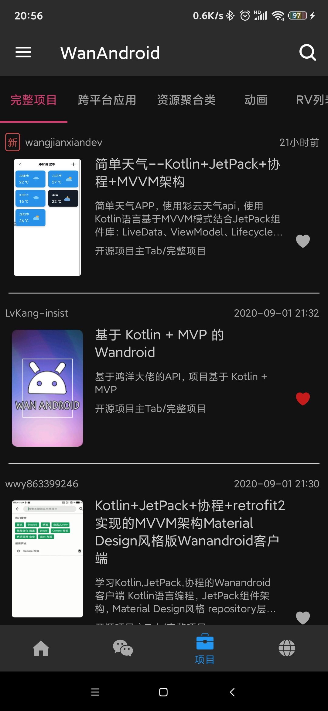
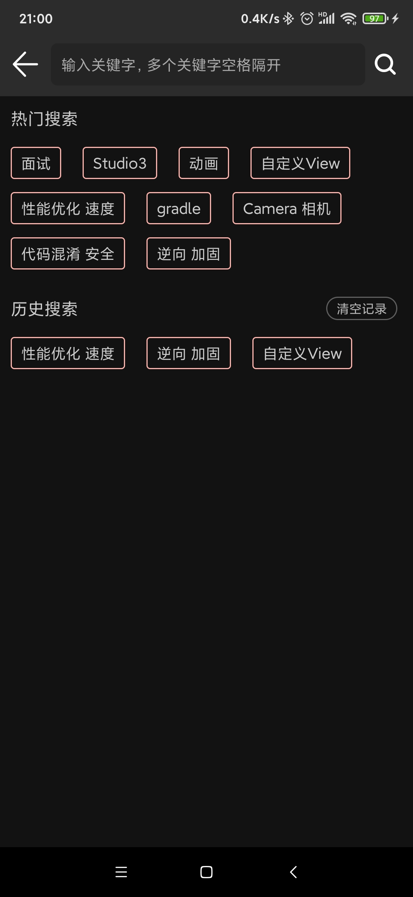
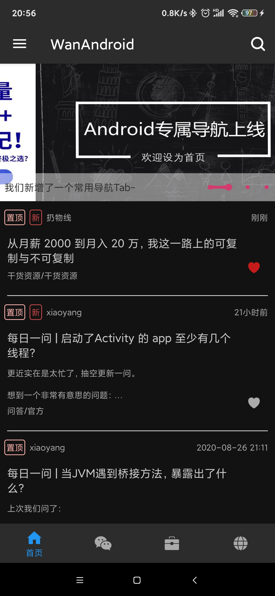

# WanAndroidJetpack
## UI展示
 
 

## 单元测试
### MergeCall及网络请求单元测试
在test文件夹下的[network包](/app/src/test/java/com/hudson/wanandroid/network)内。单元测试模拟数据存放在resources目录下，同时通过往OkHttp中添加interceptor，并设置
从resources目录下读取的json数据作为返回值。测试时需要注意确保AppExecutor是外界设置，同时针对RetrofitCall类型的需要修改Retrofit的callback回调线程调度器，具体见代码。

## 使用到的jetpack内容
### ViewModel
ViewModel配合Repository的使用
ViewModel共享数据实践(Fragment与Activity共享同一个ViewModel，见[Fragment](/app/src/main/java/com/hudson/wanandroid/ui/fragment/search))、[Activity](/app/src/main/java/com/hudson/wanandroid/ui/activity/SearchActivity.kt)及[共享ViewModel](/app/src/main/java/com/hudson/wanandroid/viewmodel/SearchModel.kt)
### WorkManager定期任务
### Paging3 仅网络数据和网络数据结合本地ROOM缓存方案的实践
见[Paging包](/app/src/main/java/com/hudson/wanandroid/data/repository/paging)，
PagingSource属于仅网络数据方案；RemoteMediator属于网络数据结合本地ROOM缓存方案
### 网络请求统一方案
#### NetworkBoundResource结合Retrofit的实践
见[NetworkBoundResource](/app/src/main/java/com/hudson/wanandroid/data/repository/base/NetworkBoundResource.kt)
#### MergeCall多请求合并
MergeCall的主要目的是解决某个页面某些数据需要多次向服务端发起请求的问题，例如首页的文章列表中，包含了置顶文章，但服务端提供了两个不同的接口，
因此需要合并这两个接口及数据，简化UI层的使用。

见[MergeCall](/app/src/main/java/com/hudson/wanandroid/data/common/mergecall)

见[MergeCall版NetworkBoundResource](/app/src/main/java/com/hudson/wanandroid/data/repository/base)
### 依赖注入Dagger2-android 实践
依赖注入本身属于Application内部维护一个Map集合管理Activity的Injector；而Activity相似地维护一个Map管理其内部的Fragment的Injector。
### Navigation实践
Navigation中由于目前其官方实现方案是使用replace fragment方式，因此出现的结果是首页结合NavigationBottomView切换过程中fragment会重新创建实例，
因此Fragment本身的内部view的状态及相关数据会被重置，需要通过ViewModel暂存，相关问题见[issues 530](https://github.com/android/architecture-components-samples/issues/530),
目前实现方案是自定义Navigator，替换系统的replace方案，见[WanAndroidNavigator](/app/src/main/java/com/hudson/wanandroid/ui/fix/WanAndroidNavigator.java)
## ROOM实践

